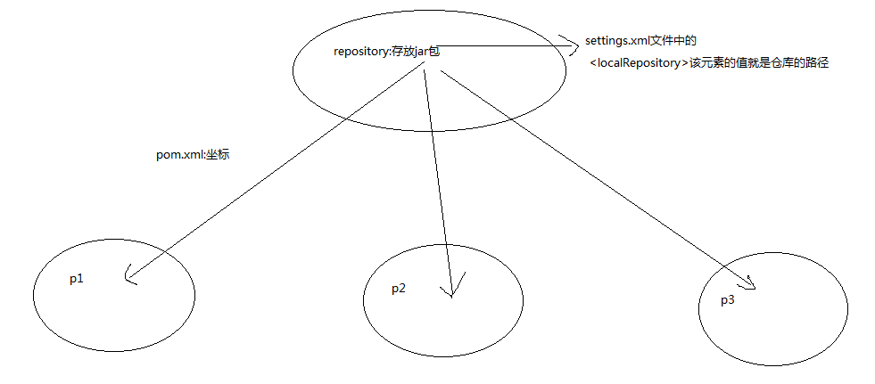

# maven的约定

maven的约定：

- src/main/java         存放项目的java文件
- src/main/resources    存放项目的资源文件，如spring，hibernate的配置文件
- src/test/java         存放所有的测试的java文件
- src/test/resources    存放测试用的资源文件
- target                项目输出位置
- pom.xml   文件

示意图：

