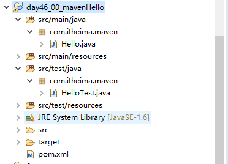

# maven的第一个例子

使用命令创建一个maven项目

```bat
mvn archetype:generate -DgroupId=com.mycompany.app -DartifactId=my-app -DarchetypeArtifactId=maven-archetype-quickstart -DarchetypeVersion=1.4 -DinteractiveMode=false
```

## 实例

目录结构如下：



1、新建Java项目：day46_00_mavenHello

2、按照约定，新建Source Folder

- src/main/java
- src/main/resources
- src/test/java
- src/test/resources

3、新建包：com.itheima.maven

4、新建类：

Hello.java

```java
package com.itheima.maven;

public class Hello {
  public void sayHello(){
    System.out.println("hello");
  }
}
```

HelloTest.java

```java
package com.itheima.maven;

public class HelloTest {
  public static void main(String[] args) {
    Hello hello = new Hello();
    hello.sayHello();
  }
}
```

5、新建pom.xml文件

```xml
<?xml version="1.0" encoding="UTF-8"?>
<project xmlns="http://maven.apache.org/POM/4.0.0" xmlns:xsi="http://www.w3.org/2001/XMLSchema-instance"
  xsi:schemaLocation="http://maven.apache.org/POM/4.0.0 http://maven.apache.org/xsd/maven-4.0.0.xsd">
  <modelVersion>4.0.0</modelVersion>
  <groupId>com.itheima.maven</groupId>
  <artifactId>Hello</artifactId>
  <version>0.0.1-SNAPSHOT</version>
</project>
```

6、编译项目

```log
//进入工程目录
cd D:\java\longlong\day46_00_mavenHello

//执行编译
mvn compile
```

生成target目录

备注：首次执行该命令时，会从网络下载对应的jar包。
