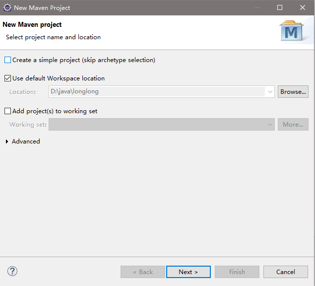
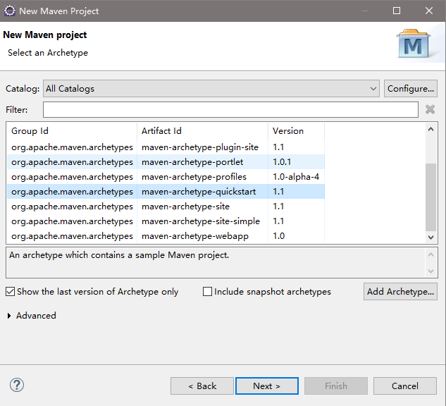
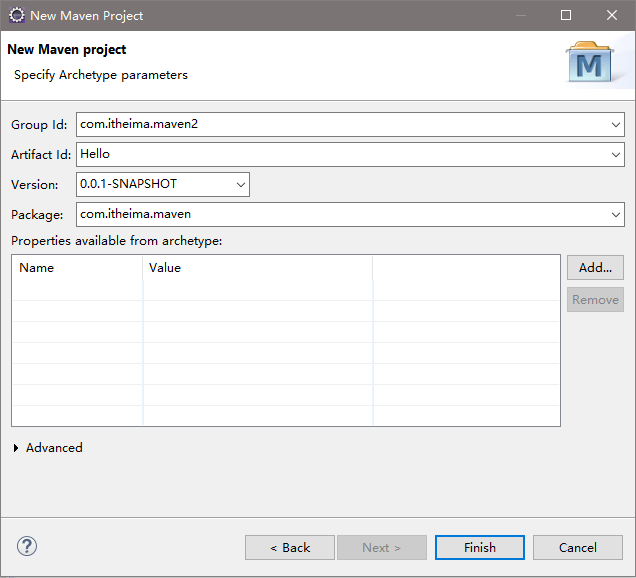
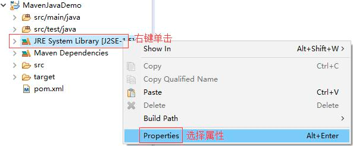
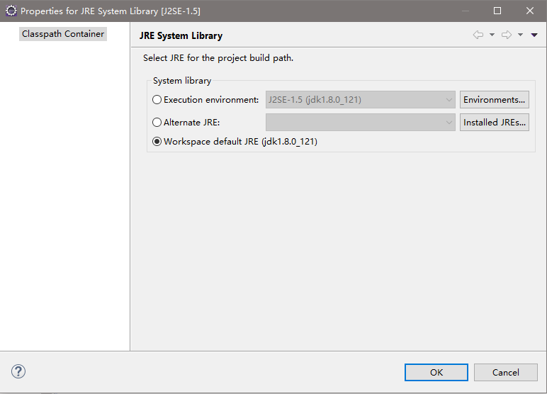
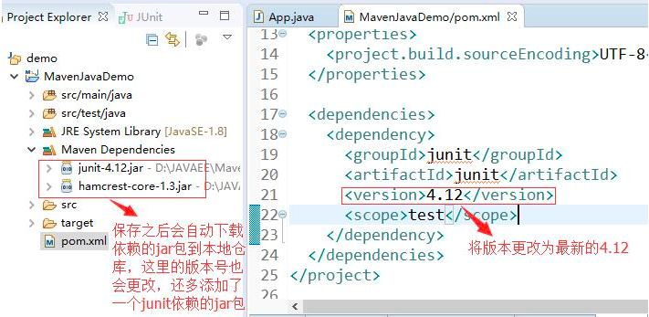
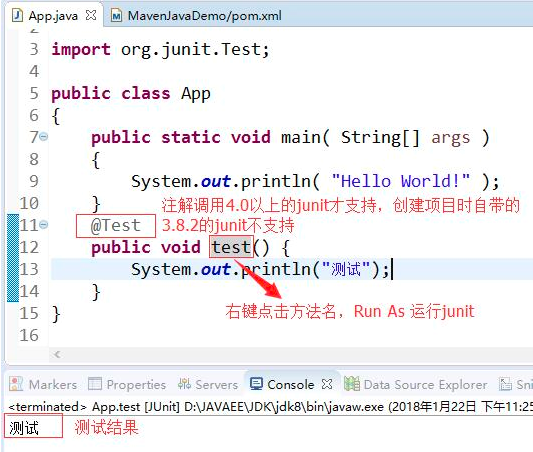
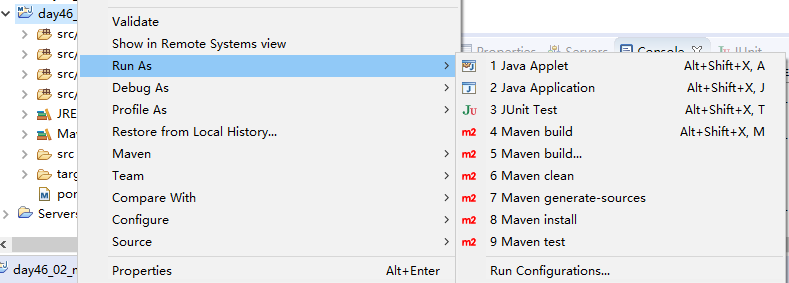

# Eclipse创建maven工程

1、选择File -- New -- Maven Project，开始创建Maven项目

- 创建一个简单的项目，跳过原型选择。
- 使用默认的物理工作空间，右边点开可以更改
- 添加项目到指定的工作集中（包含多个项目的集合）

2、选择要创建的Maven项目原型(骨架)

3、输入创建Maven项目所必须的参数

4、更改Maven项目中使用的jre

5、补充缺少的resources目录

新建Source Folder

- src/main/resources
- src/test/resources

6、更改pom.xml文件中的junit依赖

7、简单测试

8、在maven中进行编译，测试

选中项目 -- 右键 -- Run As -- Maven Test

## 参考

<https://blog.csdn.net/sky198989/article/details/81197627>

<https://www.cnblogs.com/shushengyou/p/8471519.html>

<https://www.cnblogs.com/sunddenly/p/4341542.html>