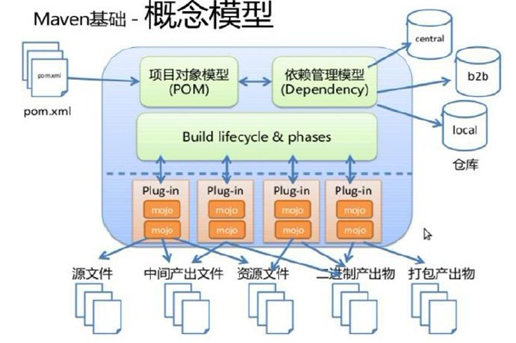

# maven的仓库

## maven的核心概念

### 1、项目对象模型



maven根据pom.xml文件，把它转化成项目对象模型(POM)，这个时候要解析依赖关系，然后去相对应的maven库中查找到依赖的jar包。

在clean，compile，test，package等阶段都有相应的Plug-in来做这些事情。
而这些plug-in会产生一些中间产物

### 2、插件的位置

在maven解压后的位置D:\java\base\apache-maven-3.6.0\有一个bin文件夹，里面有一个文件m2.config文件

```log
main is org.apache.maven.cli.MavenCli from plexus.core

set maven.conf default ${maven.home}/conf

[plexus.core]
load       ${maven.conf}/logging
optionally ${maven.home}/lib/ext/*.jar
load       ${maven.home}/lib/*.jar
```

找到配置文件：

D:\java\base\apache-maven-3.6.0\conf\settings.xml

```xml
  <!-- localRepository
   | The path to the local repository maven will use to store artifacts.
   |
   | Default: ${user.home}/.m2/repository
  <localRepository>/path/to/local/repo</localRepository>
  -->
  <localRepository>D:\java\course\maven\mavenRepository</localRepository>
```

在其中配置本地仓库的位置

执行maven的各种命令所需要的插件都保存在本地仓库中：

D:\java\course\maven\mavenRepository\org\apache\maven\plugins

### 3、maven的坐标

3.1 maven坐标的主要组成

- groupId：定义当前maven项目属于哪个项目
- artifactId：定义实际项目中的某一个模块
- version：定义当前项目的当前版本
- packaging：定义当前项目的打包方式

根据这些坐标，在maven库中可以找到唯一的jar包

### 4、仓库管理

maven的坐标定义了每一个jar包在仓库中的存储位置。

大致为：groupId/artifactId/version/artifactId-version.packaging

4.1 仓库的分类

本地仓库：每一个用户也可以拥有一个本地仓库

远程仓库：

- 中央仓库：Maven默认的远程仓库。<http://repo1.maven.org/maven2>
- 私服：是一种特殊的远程仓库，它是架设在局域网内的仓库
- 镜像：用来替代中央仓库，速度一般比中央仓库快

打开配置文件：

D:\java\base\apache-maven-3.6.0\conf\settings.xml

```xml
<!--镜像：配置私服路径-->
<mirrors>
  <mirror>
    <id>nexus</id>
    <mirrorOf>central</mirrorOf>
    <name>internal nexus repository</name>
    <url>http://192.168.1.134:8080/nexus/content/groups/public/</url>
  </mirror>
</mirrors>


<!--私服：中央仓库，正式版本-->
<profile>
  <id>nexus</id>
  <repositories>
    <repository>
      <id>nexus</id>
      <name>local private nexus</name>
      <url>http://192.168.1.134:8080/nexus/content/groups/public</url>
      <releases>
      <enabled>true</enabled>
      </releases>
    </repository>
  </repositories>
</profile>
<!--快照，开发中的版本-->
<profile>
  <id>nexus-snapshots</id>
  <repositories>
    <repository>
      <id>nexus-snapshots</id>
      <name>local private nexus snapshots</name>
      <ur1>http://192.168.1.134:8080/nexus/content/groups/public-snapshots</url>
      <releases>
        <enabled>true</enabled>
      </releases>
    </repository>
  </repositories>
</profile>
```

参考书籍：《Maven实战》
