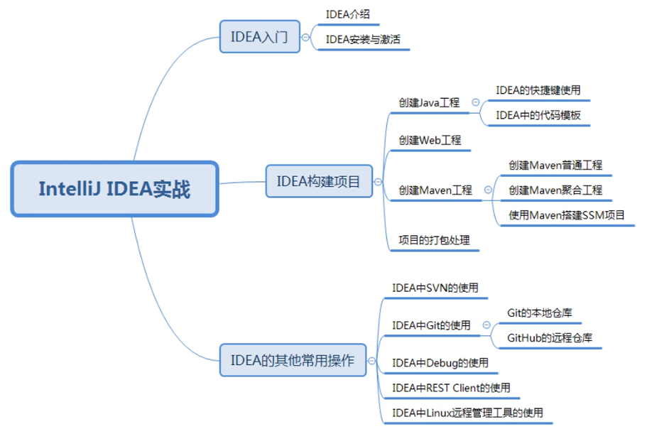

# 入门

参考：

[IDEA使用技巧](https://blog.csdn.net/abel004/article/details/90414037)

[IntelliJ IDEA使用教程](https://blog.csdn.net/qq_27093465/article/details/77449117)

[IntelliJ IDEA 简体中文专题教程](https://github.com/judasn/IntelliJ-IDEA-Tutorial)

[IDEA之创建Java、Module工程全解](https://cloud.tencent.com/developer/article/1357323)

[IntelliJ IDEA创建maven web项目](https://blog.csdn.net/czc9309/article/details/80304074)

IDEA入门：

运行main()方法:右键选择对应菜单

-DarchetypeCatalog=internal
