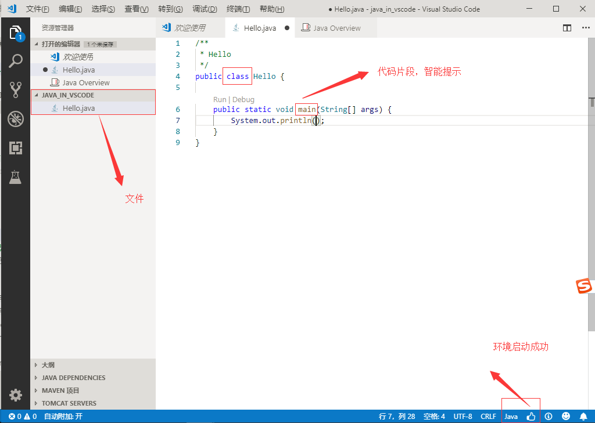
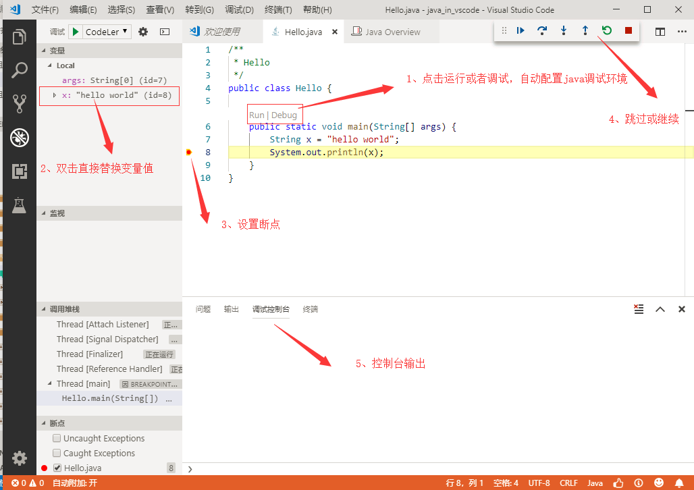

# Java拓展

## 准备工作：

### 一、环境搭建：

1、下载并安装Java SE Development Kit（JDK），配置环境变量JAVA_HOME设置为JDK的安装位置。并添加到PATH路径中

2、下载并安装Apache Maven

```bat
下载地址：https://maven.apache.org/download.cgi
安装说明：https://maven.apache.org/install

//检查环境变量配置
echo %JAVA_HOME%
C:\Program Files\Java\jdk1.7.0_51

//配置
MAVEN_HOME
D:\java\base\apache-maven-3.6.0\bin

//添加到PATH
%MAVEN_HOME%


参考：
https://www.cnblogs.com/jimisun/p/7842537.html
https://www.cnblogs.com/qbzf-Blog/p/6539161.html
https://blog.csdn.net/liubin1991liubin/article/details/79352904
```

3、安装java扩展

为了帮助在VS Code上设置Java，有一个Microsoft Java Extension Pack，它包含这些流行的扩展：

- Language Support for Java(TM) by Red Hat
- Debugger for Java
- Java Test Runner
- Maven for Java
- Java Dependency Viewer

### 二、创建程序和编辑代码

为Java程序创建一个文件夹，并使用Visual Studio Code打开该文件夹。

```log
d:\java\vscode\two>mkdir java_in_vscode
d:\java\vscode\two>cd java_in_vscode
d:\java\vscode\two\java_in_vscode>code .
```

在Visual Studio Code中，您可以创建一个新文件Hello.java。



当您打开该文件时，Java语言服务器将自动激活，因为您可以在状态栏的右侧看到火箭图标。完成加载后，您将看到一个竖起大拇指的图标。

注意：如果在Visual Studio Code中打开独立Java文件而不打开其文件夹，则Java语言服务器可能无法正常工作。

在Visual Studio Code中，您可以轻松地使用代码片段来构建您的类和方法。VS Code还为代码完成提供IntelliSense。

### 三、运行和调试程序

在Visual Studio Code中很容易运行和调试Java。您可以单击F5或使用“ 运行”|“调试 CodeLens”选项。只需设置一个断点，您就可以在Debug视图中看到所有变量和线程。



调试器还支持高级功能，如热代码替换和条件断点。

## 二、项目搭建

### 下载并测试Spring Boot应用程序

<https://code.visualstudio.com/docs/java/java-tutorial>

```bat
克隆Git存储库
Git:Clone
https://github.com/spring-guides/gs-spring-boot.git

导航到存储库文件夹打开VS Code
https://github.com/spring-guides/gs-spring-boot.git code .

打开文件Application.java
complete\src\main\java\hello\Application.java

安装扩展：Microsoft Java Extension Pack

通过按F5并选择Java环境运行该应用程序。Java Debug扩展将在项目中的.vscode文件夹下生成launch.json调试配置文件

使用浏览器访问：http://localhost:8080

参考：
https://spring.io/guides/gs/spring-boot/
https://blog.csdn.net/tongtong_use/article/category/7312349
```

参考：

<https://www.imooc.com/article/39349>

<https://blog.csdn.net/amyloverice/article/details/79388270>

<https://blog.csdn.net/qq_38906523/article/details/77278403>
