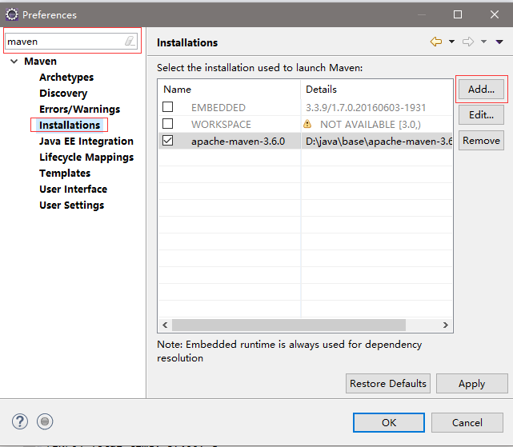
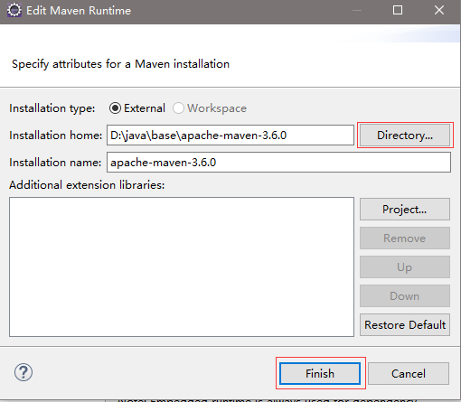
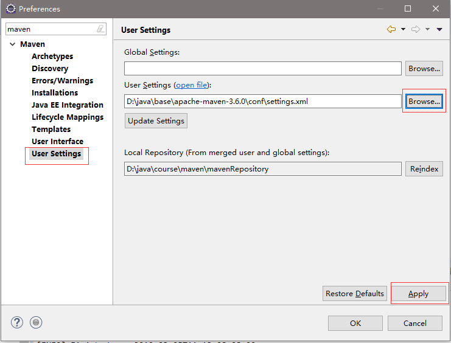

# Eclipse中maven的配置

Window -- Preferences -- 输入：maven

Maven -- installations -- Add -- Installation home:找到Maven的解压目录 -- Finish

Maven -- User Settings -- User Settings(open file):找到conf目录下的settings.xml文件

