# web工程的创建

参考：

- <https://www.cnblogs.com/shushengyou/p/8471519.html>
- <https://www.cnblogs.com/h--d/p/6000778.html>

## 一、Maven项目的新建

1、鼠标右键---->New----->Other

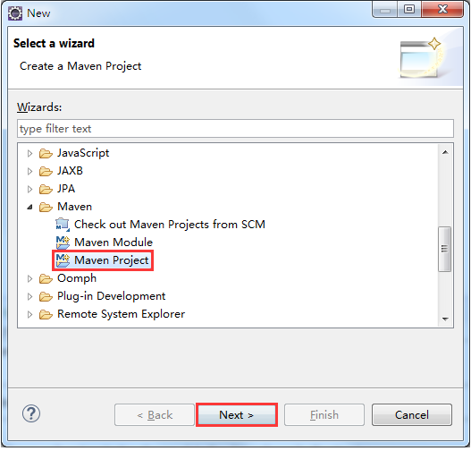

2、直接点击下一步

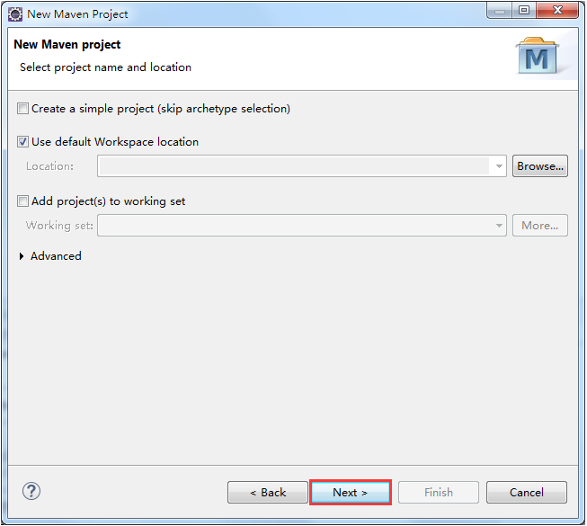

3、选中maven-archetype-webapp后点击下一步

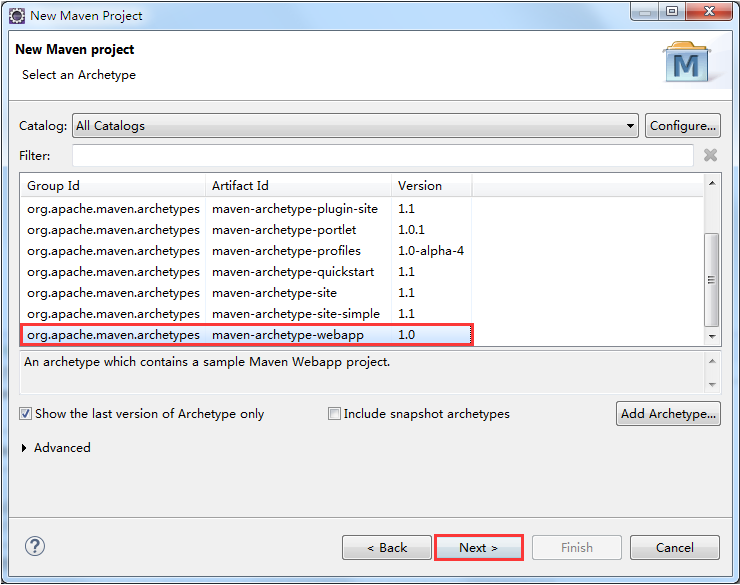

4、填入Maven项目基本信息

- Group Id 中输入项目的基本包名。
- Artifact Id 中输入项目名。
- Version 中的值默认就行，不进行选择。
- Package 中写的是默认生成的一个包名，不写也可以。

点击完成即可。

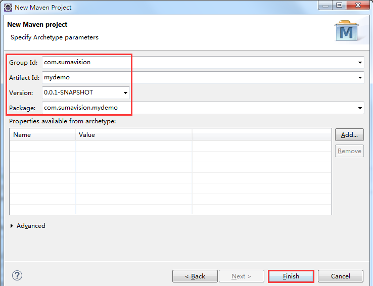

5、创建好项目后结构如下：

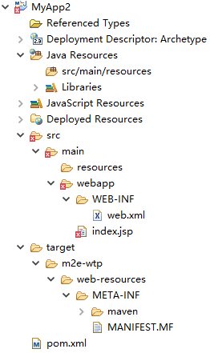

备注：

- web.xml的版本是2.3的，是老版本
- 新生成的工程默认的jdk和compiler都是1.5 的
- 而且没有src/main/java这样结构的maven目录

## 二、Maven项目的配置

1、修改web.xml

由于Maven中的 maven-archetype-webapp样板项目的web.xml是2.3版本的，我们需要替换成新版本：

可以在Eclipse中新建一个web工程，将它WebContent/WEB-INF目录下的web.xml文件复制替换掉我们的Maven项目中src/main/webapp/WEB-INF/目录下的web.xml文件。

原来的web.xml内容

```xml
<!DOCTYPE web-app PUBLIC
 "-//Sun Microsystems, Inc.//DTD Web Application 2.3//EN"
 "http://java.sun.com/dtd/web-app_2_3.dtd" >

<web-app>
  <display-name>Archetype Created Web Application</display-name>
</web-app>
```

替换后的web.xml内容

```xml
<?xml version="1.0" encoding="UTF-8"?>
<web-app xmlns:xsi="http://www.w3.org/2001/XMLSchema-instance" xmlns="http://xmlns.jcp.org/xml/ns/javaee" xsi:schemaLocation="http://xmlns.jcp.org/xml/ns/javaee http://xmlns.jcp.org/xml/ns/javaee/web-app_3_1.xsd" id="WebApp_ID" version="3.1">

    <display-name>mydemo</display-name>
    <welcome-file-list>
        <welcome-file>index.html</welcome-file>
        <welcome-file>index.htm</welcome-file>
        <welcome-file>index.jsp</welcome-file>
        <welcome-file>default.html</welcome-file>
        <welcome-file>default.htm</welcome-file>
        <welcome-file>default.jsp</welcome-file>
    </welcome-file-list>
</web-app>
```

2、可以在pom.xml里面build标签下添加maven编译插件(可选)

```xml
<plugins>
    <plugin>
        <artifactId>maven-compiler-plugin</artifactId>
        <version>3.1</version>
        <configuration>
            <source>1.8</source>
            <target>1.8</target>
        </configuration>
    </plugin>
</plugins>
```

3、添加缺少的目录并指定输出路径

Maven约定，创建以下几个包，并且分别对应相应的输出路径

- src/main/resources
- src/main/java
- src/test/resources
- src/test/java

右键项目----->BUild Path----->Configure Build Path...

（1）在Order and Export（这里是控制项目中包的显示顺序的）这个栏里会发现有几个目录显示missing（丢失），随便选中一个改变下顺序（Up 或者 Down 或者 Top 或者 Bottom），然后点击应用，OK，丢失的目录会在项目中显示出来，再次进到这个地方，红叉标识已经消失了。（这一步比较奇怪，可能是eclipse中maven插件的bug吧）

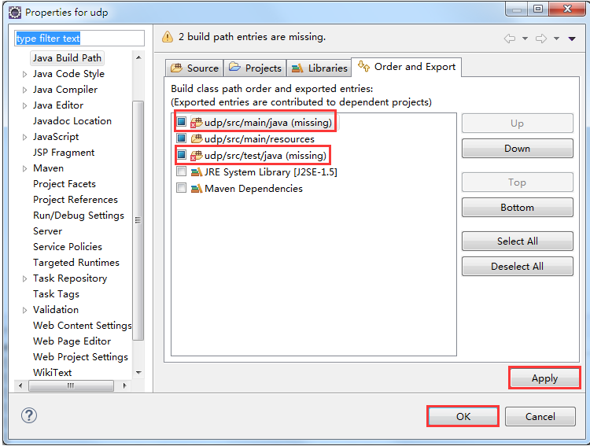

（2）接着在Source里会发现已经有三个目录了，所以点击Add Folder... 添加缺少的目录（这里注意把Allow output folders for source folders 上，方便下一步进行输出路径的设置）

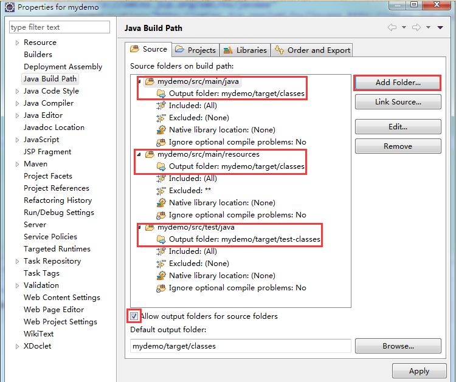

点击Create New Folder, 输入缺少的包名，直接点击完成，回到这个界面点击OK就行

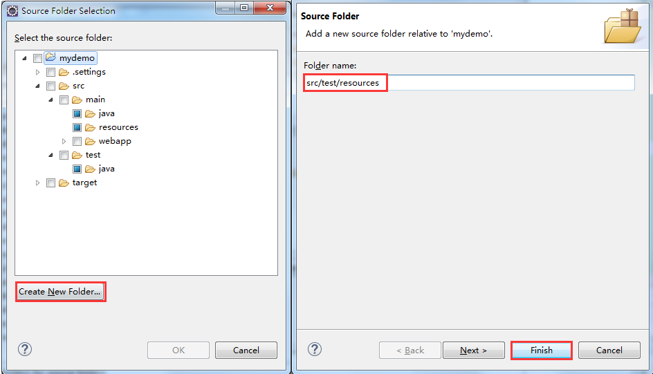

（3）接着就会看到Source这里多了一个刚才添加的包，这个新加的包没有指定输出目录，需要进行修改

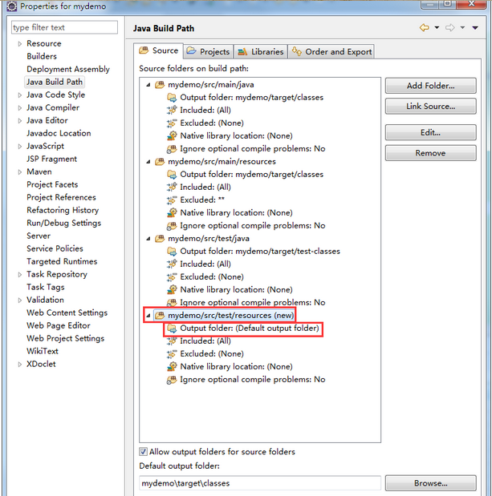

在Source 里面设定4个文件夹的输出Output folder，双击进行修改

分别修改输出路径为

/src/main/resources对应target/classes

/src/main/java对应target/classes

/src/test/resources对应target/test-classes

/src/test/java对应target/test-classes

我这只需要修改第四个目录就可以了（前三个都默认设置好了，如果你的没设置好就设置一下）

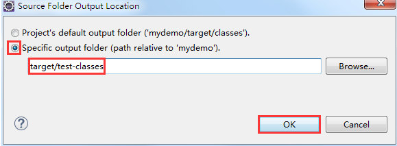

最终的效果如下图所示：

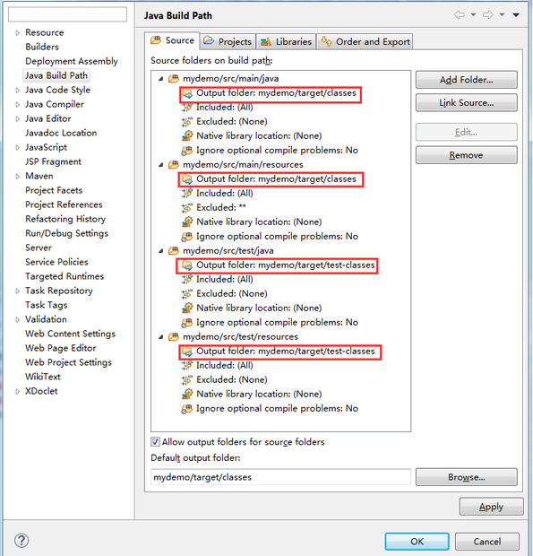

此时的目录结构为：

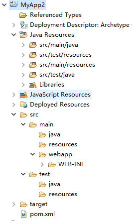

可以看出已经是maven项目的结构了。

4、配置项目部署程序集

右键项目----->Properties----->Deployment Assembly

（1）删除test的两项，因为test是测试使用，并不需要部署。

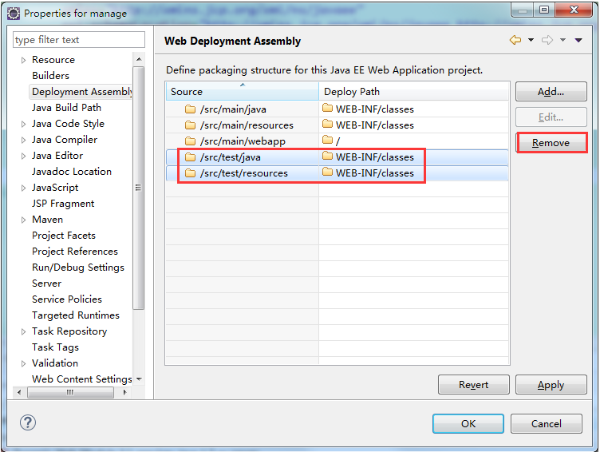

（2）添加Maven依赖，设置将Maven的jar包发布到lib下，如果已经有了就不需要添加了。

Add -- Java Build Path Entries -- Maven Dependencies -- Finish

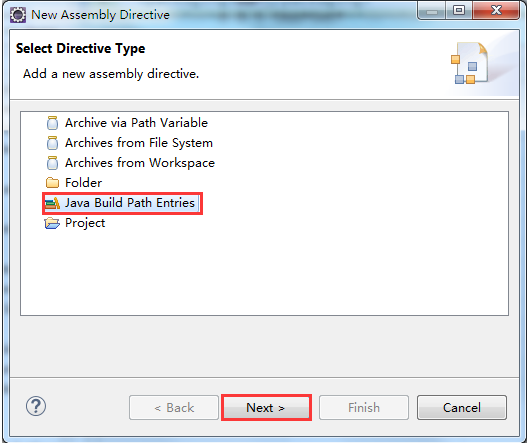

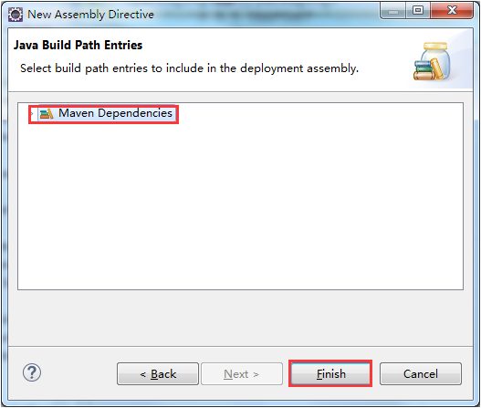

最终是这样的

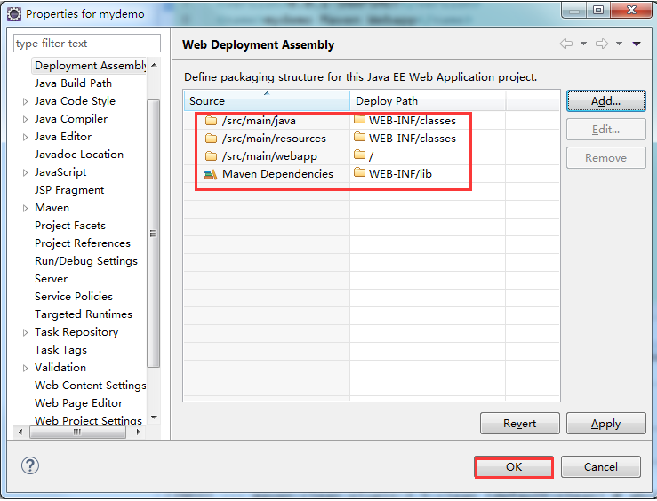

## 三、将Maven项目转换成Dynamic Web Project

（1）右键项目----->Properties

在左侧选择 Project Facets，单击右侧的 Convert faceted from

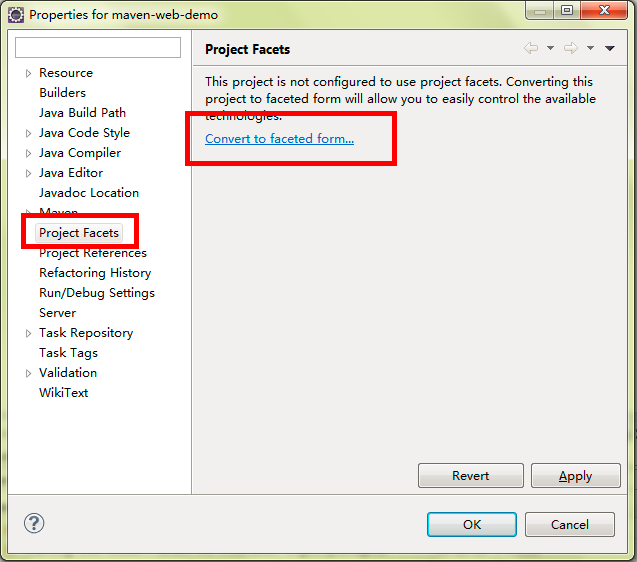

刚进来时是这样的，需要把Dynamic Web Module（动态web模块）的版本修改为3.1（最新版），Java的版本修改为项目用的1.8

这里可能会报一个错误，在修改动态web模块版本的时候会提示Cannot change version of project facet Dynamic Web Module to 3.1

不要紧，只需要去掉动态web模块前面的对勾，点击OK，接着再进入这个界面就能够修改动态web模块的版本了。

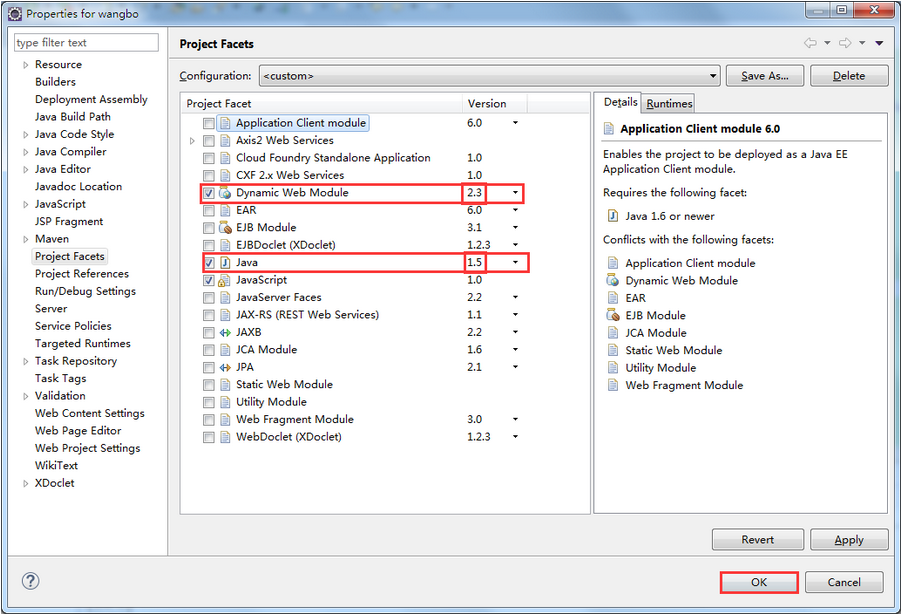

修改完成是这样的，接下来单击 Further Configuration available... （进一步可用的配置）链接

下面如果没有显示出Further Configuration available...的话，可以在Dynamic Web Module前去掉打钩，点击应用，然后再填上钩，再点击应用，一般Further Configuration available...就会出现了。

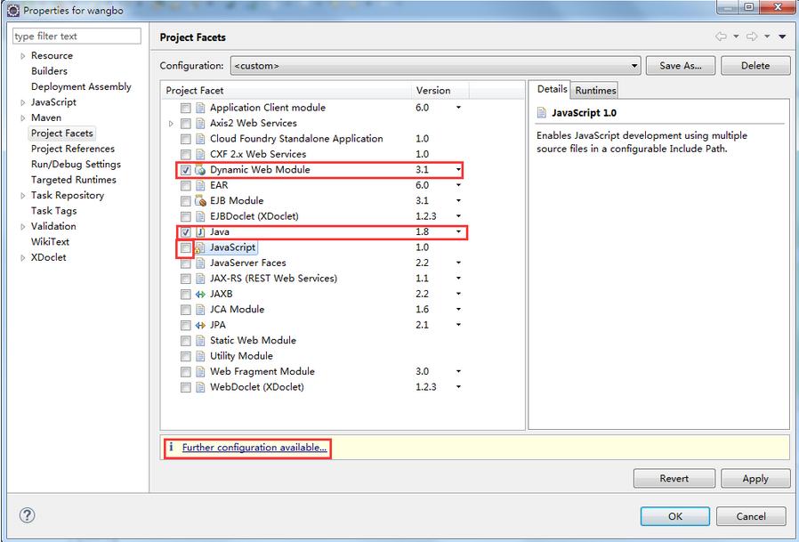

修改Content directory（内容目录）的值WebContent为src/main/webapp，单击OK，然后回到上一步窗口直接点击OK

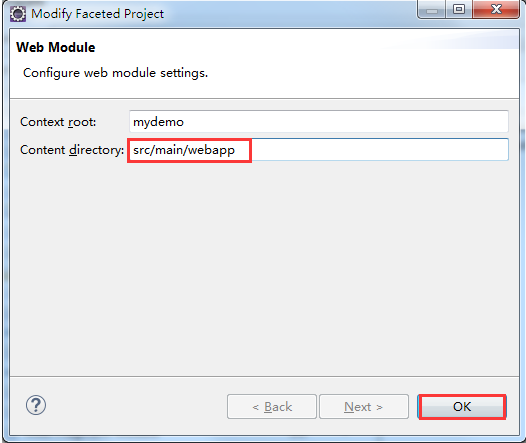

完成这一步之后你可以检查下你的Java Build Path 中的Libraries 中的jdk版本，还有Java Compiler (编译环境)，发现都已经改为1.8版本了。

（2）接下来你项目中的pom.xml 可能报一个错

```log
web.xml is missing and <failOnMissingWebXml> is set to true 
```

如果没报错，可以忽略不看

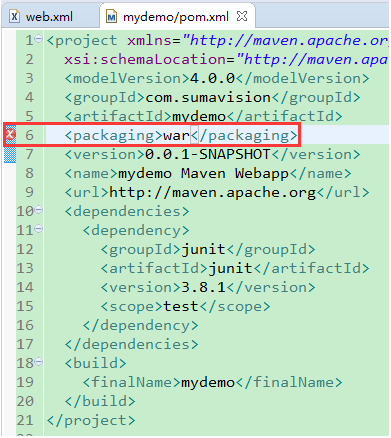

解决办法：

使用maven创建项目有时在pom.xml的war处出现failOnMissingWebXml的错误，根据pom.xml 可以知道这个项目是web项目，打包时打成war包。

错误提示的是丢失web.xml，所以如果项目里没有web.xml，则在项目里添加一个web.xml，刷新一下项目，就应该没有错误了。

如果还有错的话就需要在eclispe上方点击Project ----->Clean清理一下这个项目了。

经过这两步错误就应该已经清除了。
