# oracle安装说明

## 准备工作

安装指南：

<https://jingyan.baidu.com/article/363872eccfb9266e4aa16f5d.html>

<https://www.cnblogs.com/hoobey/p/6010804.html>

<http://www.oraclejsq.com/jsq/getOracle_jcjc.do?nodeid=010100113>

卸载教程：

<https://jingyan.baidu.com/article/922554468d4e6b851648f4e3.html>

## 1、下载安装文件

网址：
<http://www.oracle.com/technetwork/database/enterprise-edition/downloads/index.html>

注册账号：xuepeilong@outlook.com

Oracle Database 11g Release 2 (11.2.0.1.0)

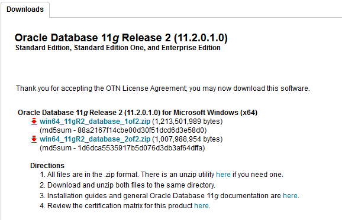

下载完成后，将2个压缩文件一起选中，鼠标右键—>解压文件,两个压缩文件解压到同一目录下。


打开相应的解压路径，找到安装文件“setup.exe”，双击进行安装


此时弹出【INS-13001环境不满足最低要求】的提示框，此时可以选择【是】继续安装，也可以选择【否】结束安装。

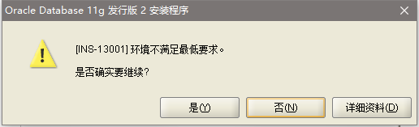

修改配置文件，防止再次弹出此提示：

在解压后的Oracle安装文件目录中，找到stage\cvu\cvu_prereq.xml文件


```xml
<OPERATING_SYSTEM RELEASE="6.2">
    <VERSION VALUE="3"/>
    <ARCHITECTURE VALUE="64-bit"/>
    <NAME VALUE="Windows 10"/>
    <ENV_VAR_LIST>
        <ENV_VAR NAME="PATH" MAX_LENGTH="1023" />
    </ENV_VAR_LIST>
</OPERATING_SYSTEM>
```

## 2、安装配置

配置安全更新。电子邮件可写可不写，取消下面的“我希望通过My Oracle Support接受安全更新(W)”，如下图所示，单击下一步。

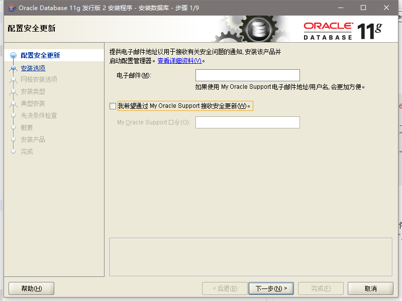

安装选项。直接选择默认的“创建和配置数据库”，如下图所示，单击下一步。

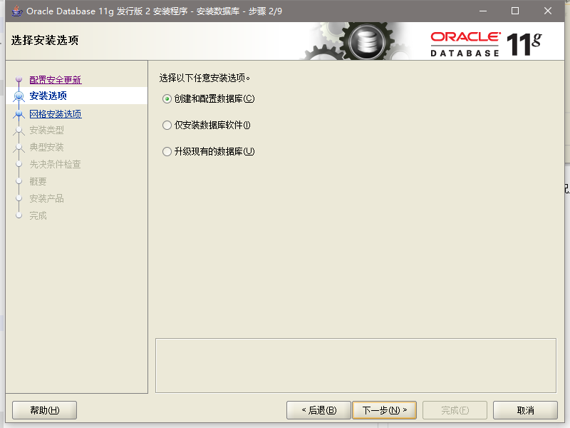

系统类，直接选择默认的桌面类就可以了

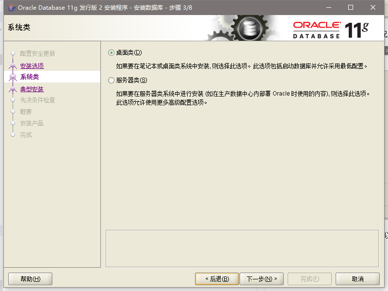

典型安装。 重要步骤。建议只需要将Oracle基目录更新下，目录路径不要含有中文或其它的特殊字符。全局数据库名可以默认，且口令密码，必须要牢记。密码输入时，有提示警告，不符合Oracel建议时不用管。 (因Oracel建议的密码规则比较麻烦， 必须是大写字母加小写字母加数字，而且必须是8位以上。麻烦，可以输入平常自己习惯的短小密码即可)  如图：

管理口令：Longlong123

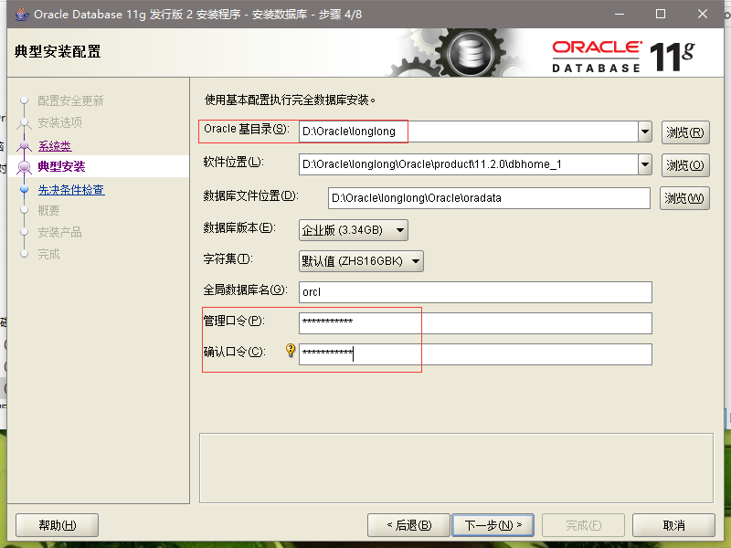

先决条件检查。安装程序会检查软硬件系统是否满足，安装此Oracle版本的最低要求。直接下一步就OK了。

概要。安装前的一些相关选择配置信息。可以保存成文件或不保存文件直接点完成即可。如图：

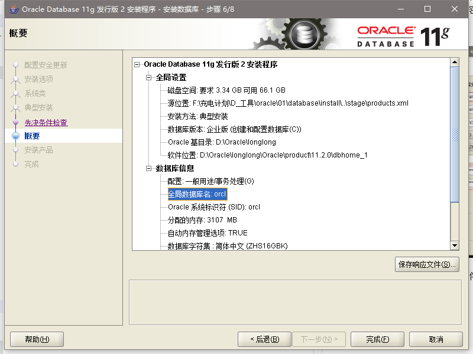

 安装产品，自动进行，不用管。如图：

 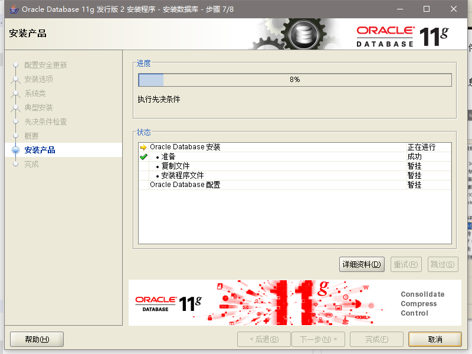

数据库管理软件文件及dbms文件安装完后，会自动创建安装一个实例数据库默认前面的orcl名称的数据库。

实例数据库创建完成了，系统 默认是把所有账户都锁定不可用了(除sys和system账户可用外)，建议点右边的口令管理，将常用的scott账户解锁并输入密码。

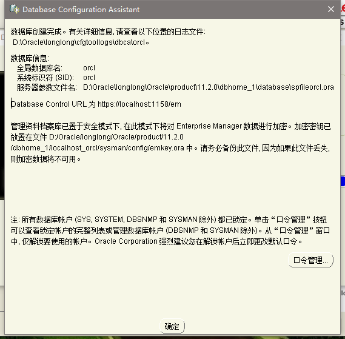

 解锁scott账户， 去掉前面的绿色小勾，输入密码。

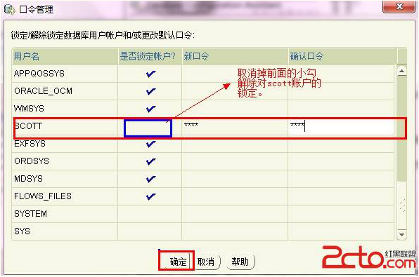

安装成功

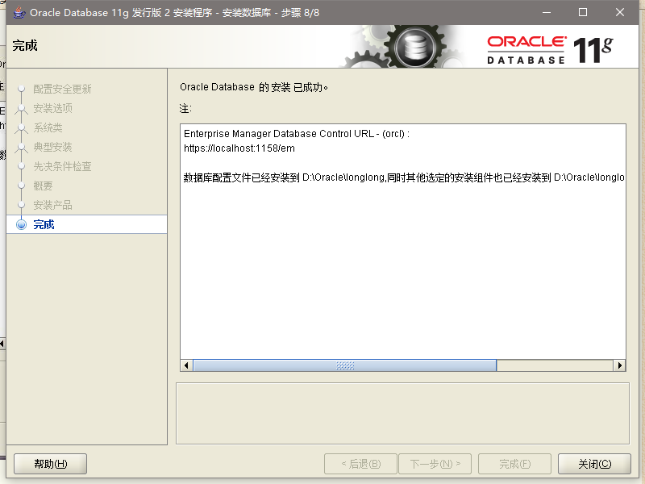
