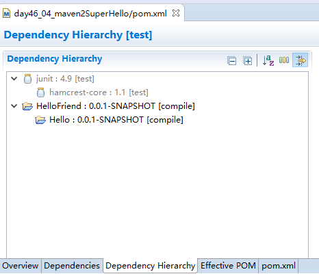

# maven依赖的传递

## 实例

1、新建Maven项目：day46_02_maven2Hello

pom.xml

```xml
<project xmlns="http://maven.apache.org/POM/4.0.0" xmlns:xsi="http://www.w3.org/2001/XMLSchema-instance"
  xsi:schemaLocation="http://maven.apache.org/POM/4.0.0 http://maven.apache.org/xsd/maven-4.0.0.xsd">
  <modelVersion>4.0.0</modelVersion>

  <groupId>com.itheima.maven2</groupId>
  <artifactId>Hello</artifactId>
  <version>0.0.1-SNAPSHOT</version>
  <packaging>jar</packaging>

  <name>Hello</name>
  <url>http://maven.apache.org</url>

  <properties>
    <project.build.sourceEncoding>UTF-8</project.build.sourceEncoding>
  </properties>

  <dependencies>
    <dependency>
      <groupId>junit</groupId>
      <artifactId>junit</artifactId>
      <version>4.9</version>
      <scope>test</scope>
    </dependency>
  </dependencies>
</project>
```

2、新建Maven项目：day46_03_maven2HelloFriend

pom.xml

```xml
<dependencies>
  <dependency>
    <groupId>junit</groupId>
    <artifactId>junit</artifactId>
    <version>4.9</version>
    <scope>test</scope>
  </dependency>

  <dependency>
    <groupId>com.itheima.maven2</groupId>
    <artifactId>Hello</artifactId>
    <version>0.0.1-SNAPSHOT</version>
  </dependency>
</dependencies>
```

3、新建Maven项目：day46_04_maven2SuperHello

pom.xml

```xml
<dependencies>
  <dependency>
    <groupId>junit</groupId>
    <artifactId>junit</artifactId>
    <version>4.9</version>
    <scope>test</scope>
  </dependency>
  
  <dependency>
    <groupId>com.itheima.maven2</groupId>
    <artifactId>HelloFriend</artifactId>
    <version>0.0.1-SNAPSHOT</version>
  </dependency>
</dependencies>
```

### 查看依赖关系

选中pom.xml -- Open With -- Maven POM Editor


